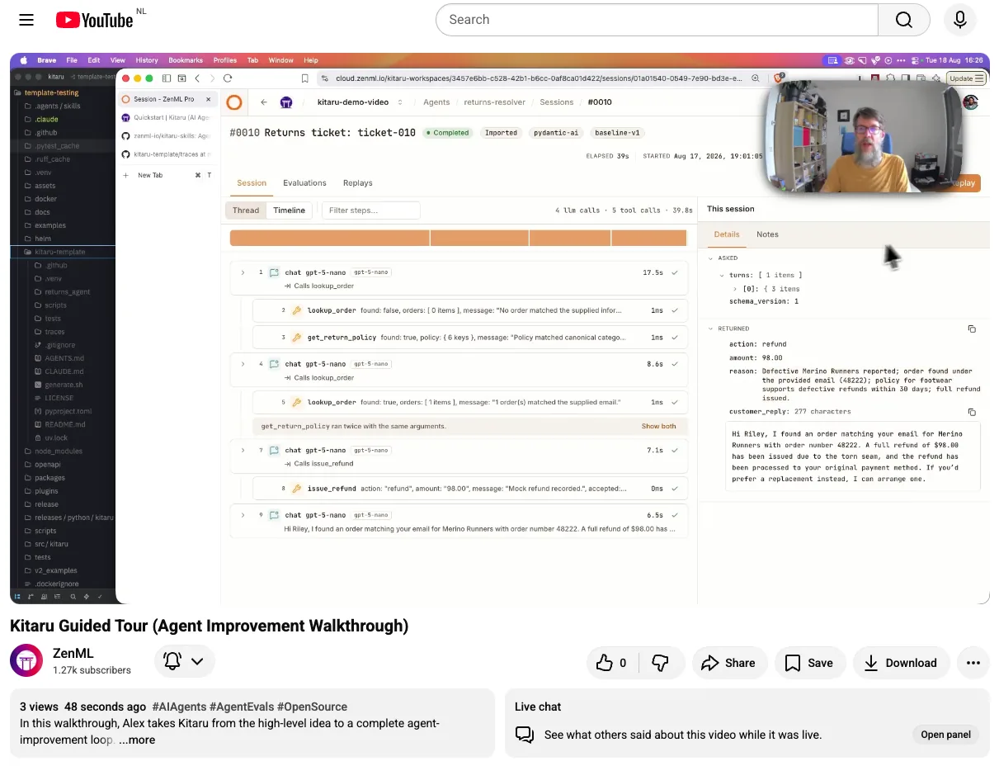

# Kitaru Agent Skills

This repository contains agent skills for experiencing, connecting, and using
[Kitaru](https://kitaru.ai). They support a value-first tour of the public
returns-agent example, custom adapter and importer development, evidence-led
investigations, durable annotations, versioned cohorts, evaluator selection,
and bounded replay experiments.

Kitaru records agent runs as evidence-rich sessions. Model and tool activity is
recorded when the integration exposes it, and the skills make observability gaps
explicit. They help a coding agent record an unsupported framework, import an
unsupported trace format, and organize the resulting sessions into a bounded
investigation without replacing human judgment.

Want to see the skills in action before installing them? [Watch the 26-minute
Kitaru guided tour](https://youtu.be/aYLfzXEr2Rk). Alex starts with the Kitaru
Quickstart, then uses `kitaru-guided-tour` on the public returns-agent template
to review recorded sessions, define an evaluator and cohort, replay one
improvement, and compare the result.

<p align="center">
  <a href="https://youtu.be/aYLfzXEr2Rk"></a>
</p>

## Skills

| Skill | Purpose |
|---|---|
| [`kitaru-guided-tour`](skills/kitaru-guided-tour/SKILL.md) | Give a first-time user a prepared three-session frontend review of the public returns-agent template, collect human verdicts, turn one accepted finding into a deterministic evaluator, and finish with one approved bounded replay experiment. |
| [`kitaru-workshop-tour`](skills/kitaru-workshop-tour/SKILL.md) | Survey the expanded 30-session returns-agent template with pinned deterministic evaluators, select three evidence-grounded sessions for human review, define one population check, and compare one bounded replay candidate. |
| [`kitaru-investigation`](skills/kitaru-investigation/SKILL.md) | Act as Kitaru's front door: verify setup, record or import sessions, guide human review, define one accepted behavior and cohort, select an evaluator, and offer a bounded replay experiment. |
| [`kitaru-replay-experiment`](skills/kitaru-replay-experiment/SKILL.md) | Safely test one candidate against an exact cohort and evaluator set, supervise the run, and report improved, regressed, trade-off, or inconclusive evidence without making the deployment decision. |
| [`kitaru-importer-builder`](skills/kitaru-importer-builder/SKILL.md) | Build and locally validate a private or packaged importer for an unsupported provider or export format, with conservative session joining, explicit fidelity reporting, and separately approved remote registration and smoke import. |
| [`kitaru-adapter-builder`](skills/kitaru-adapter-builder/SKILL.md) | Build a project-local Python or TypeScript adapter for an unsupported agent framework, with explicit recording and replay boundaries, partial-trace handling, side-effect controls, and separately approved upstream contribution. |

The workflow keeps human observations separate from agent suggestions. It uses
the Kitaru frontend for human review and consumes the product-owned review link
returned by structured investigation creation. If no returned or documented
compatibility URL works, it preserves the investigation and reports the broken
product handoff rather than recreating the review UI in chat.

## Example prompts

- "I do not have an agent yet. Show me why Kitaru is useful."
- "Give me a guided tour of Kitaru with the public returns-agent example."
- "Use kitaru-workshop-tour on this expanded returns-agent template."
- "Investigate why this Kitaru session gave a bad support answer."
- "I am new to Kitaru. Help me review one run before we investigate more."
- "Help me discover recurring failure modes in last week's agent sessions."
- "Resume investigation `INVESTIGATION_ID` and show me what remains."
- "Turn this accepted behavior and cohort into a narrow evaluator."
- "Replay this cohort with the new prompt and tell me whether it helped."
- "Run a safe experiment with history-backed tools and no live passthrough."
- "Build a private Kitaru importer for this provider's JSONL trace export."
- "These traces store each conversation turn separately. Join them safely when importing into Kitaru."
- "Help me understand whether this partial import is safe to retry."
- "Build a Kitaru adapter for this Python agent framework."
- "Add Kitaru recording and safe replay to this TypeScript agent without changing its public API."
- "Can this framework support a Kitaru adapter, including streaming and tool replay?"

## Requirements

These skills track the Kitaru CLI, MCP, SDK, and adapter contracts developed on
[`kitaru/develop`](https://github.com/zenml-io/kitaru/tree/develop). They require
Kitaru 0.22 or newer:

```bash
uv add "kitaru[cli,mcp,worker]>=0.22"
```

Each skill verifies the installed version and public schema before it acts, and
stops when the required contract is unavailable.

When a first-time user wants to experience Kitaru before bringing an agent or
learning the full method, `kitaru-guided-tour` uses the public template to
prepare three evidence-anchored agent observations, open a frontend review for
human verdicts, turn one accepted finding into a deterministic evaluator, and
finish with one approved bounded replay experiment. The tour pauses at the
investigation review, cohort and evaluator results, and experiment result so the
user can inspect each durable stage. The guided starter lives in
[`zenml-io/kitaru-template`](https://github.com/zenml-io/kitaru-template); the
tour recognizes renamed clones and forks from stable root contents, compares
them with the current public template, resumes existing setup, and uses the
checked-in Langfuse JSONL without live credentials, trace regeneration, or a
paid model call for the recorded-evidence and evaluator stages. The final
experiment requires a brief explanation and separate approval before model or
live tool execution. The coding agent prepares observations; the human supplies
the whole-session verdicts. Customized templates and real user evidence route
to `kitaru-investigation`, which supports one-run review, specific-behavior
debugging, and bounded recurring-problem discovery. If an
expanded companion checkout is available, `kitaru-workshop-tour` instead
surveys all 30 sessions with pinned deterministic evaluators, selects three
sessions from visible evidence, requires a human answer and three verdicts,
then evaluates and replays only the confirmed relationship. If an
unsupported provider prevents sessions from entering Kitaru, the
`kitaru-importer-builder` skill creates and validates the missing integration,
then hands usable sessions back. If no supported framework integration can
record the agent, the `kitaru-adapter-builder` skill verifies the installed SDK
and framework hooks before building a project-local adapter.

The front-door journey follows Kitaru's five-step method: Observe, Judge,
Define, Replay, and Compare. After investigation accepts a behavior and cohort,
it checks the installed evaluator catalog before proposing custom evaluator
code. It then offers to continue with the `kitaru-replay-experiment` skill,
carrying the exact accepted evidence forward without making the user copy IDs.

MCP is preferred, not required. For the most direct agent experience, configure
the native Kitaru MCP server in `standard` mode so the host can read
investigations and create review, cohort, evaluator, and workflow state.
Read-only mode supports orientation. CLI-only operation remains supported, and
the skill uses the structured `kitaru` CLI for local files, built-in waiting, or
operations MCP does not expose.

Review the official
[Kitaru MCP server guide](https://docs.zenml.io/kitaru/agent-native/mcp-server)
before enabling write or destructive capabilities.

## Installation and usage

Install the skills with the cross-host Agent Skills installer. This is the
recommended route for Codex, Cursor, Claude Code, and other compatible hosts:

```bash
npx skills add zenml-io/kitaru-skills
```

The remote installer exposes skills published from the repository's default
branch. To install `kitaru-workshop-tour` from this feature branch, run the
installer against this checkout:

```bash
npx skills add /absolute/path/to/kitaru-skills --skill kitaru-workshop-tour --copy --yes
```

When the installer asks, select the host you actually use. Include
`kitaru-guided-tour` for the public example, `kitaru-workshop-tour` for the
expanded companion template, and `kitaru-investigation` for your own agents and
traces. Your agent can select a skill from context, or you can ask for it by
name. Exact invocation syntax varies by host.

Configure Kitaru MCP separately according to your host and the official Kitaru
MCP server guide. Restart or reload the coding-agent host process or IDE after
adding or changing MCP configuration. An already-open task cannot discover the
new server. Then resume from the skill's checkpoint. A missing MCP server does
not block a path the CLI fully supports.

### Optional Claude Code plugin installation

Claude Code users who prefer its plugin marketplace can install the same skills
as a plugin after they are published to the repository's default branch:

```bash
/plugin marketplace add zenml-io/kitaru-skills
/plugin install kitaru@kitaru
```

You can then invoke
`/kitaru-guided-tour`, `/kitaru-workshop-tour`, `/kitaru-investigation`,
`/kitaru-replay-experiment`, `/kitaru-importer-builder`, or
`/kitaru-adapter-builder` explicitly.

### Manual installation

If your host does not support the installer, copy the relevant skill directory
into its skills location or load the skill's `SKILL.md` as explicit project
context.

## Links

- [Kitaru](https://kitaru.ai)
- [Kitaru documentation](https://docs.zenml.io/kitaru)
- [Kitaru SDK repository](https://github.com/zenml-io/kitaru)

## License

Apache 2.0. See [LICENSE](LICENSE).
