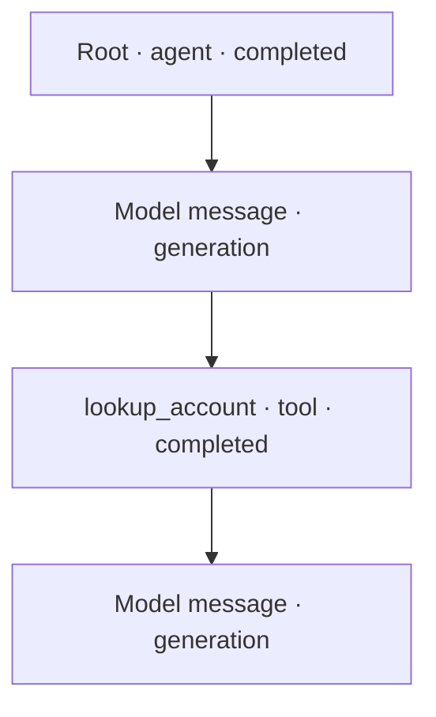
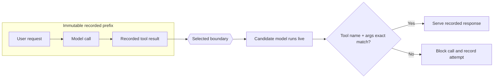
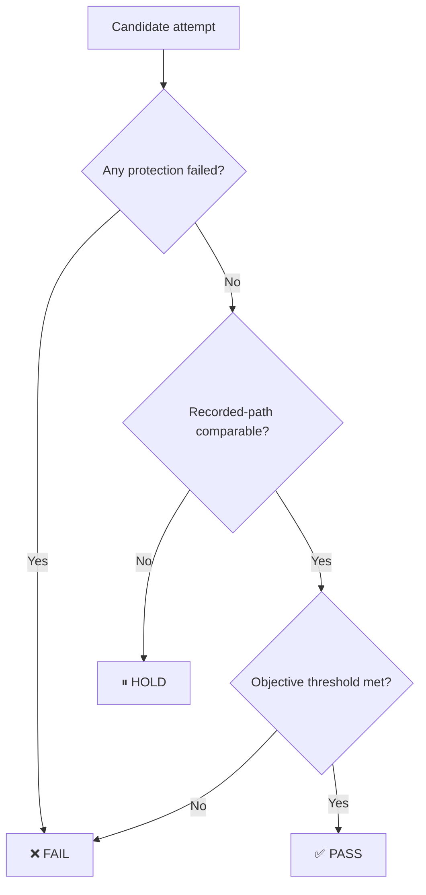

# Visual evidence and pause contract

Read this file before the first user-facing update. Apply it to every phase,
including failure paths. The user should be able to understand the investigation
by scanning headings, status symbols, diagrams, and short implications.

## Evidence ladder

Use the same three states everywhere:

| State | Meaning | Consequence |
|---|---|---|
| ✅ PASS | Evidence supports the next claim | Continue to the next rung |
| ⏸ HOLD | Evidence is incomplete or not comparable | Diagnose or narrow the claim |
| ❌ FAIL | Evidence shows forbidden or unsuccessful behavior | Stop this candidate path |

Do not use PASS to mean that a command merely exited zero. Name the claim that
passed, such as source attribution, recorded-path comparability, or a protection.

The portable ladder is:

```text
Trace selected → Import verified → Boundary validated → Control reproduced
               → Candidate protected → Bounded rerun passed → CI gate ready
```

Use Mermaid as a supplemental view only when the host is known to render it.

Never visually connect two rungs until the earlier rung's completion criterion
has been checked.

## Pause card

At every pause, use this exact order:

### 1. Outcome heading

```text
## ⏸ Import preview ready
```

Use one status symbol and name the claim being evaluated.

### 2. Evidence table

Show only facts relevant to the decision:

| Check | Observed | State |
|---|---|---|
| Trace selection | one exact trace | ✅ |
| Source attribution | caller-attributed | ⏸ |
| Importer readiness | root input ready | ✅ |
| Message-history boundary | adapter validation pending | ⏸ |
| Destination | local isolated stack | ✅ |

### 3. Agent implication

Write two to four direct sentences explaining the mechanism in the user's
agent. Name the agent, candidate, tools, and behavior where known.

Example:

> This trace contains the complete result of your
> `lookup_account` call, so Kitaru can return that recorded result without
> calling the service. Your `issue_refund` tool can move money. A changed
> refund call will therefore be blocked before its real Python callable runs.
> The blocked attempt still becomes evidence about what the candidate tried.

Avoid generic statements such as "this is safe" without naming what cannot run.

### 4. What the next action changes

Distinguish state changes from read-only actions:

| Next action | Writes data? | Calls a model? | Can call live tools? | Expected cost |
|---|---:|---:|---:|---:|
| Import selected trace | yes | no | no | $0 |
| Candidate replay | yes | yes | no live tool callables run | estimate or unknown |

### 5. Decision

Ask one precise question:

> Store this trace in the displayed Kitaru stack and record its immutable
> execution ID?

Do not ask "Continue?" or combine unrelated approvals.

In reduced/demo mode, combine several read-only findings into one pause card,
but keep storage, paid execution, and file edits as separate authorized actions
unless one paid-execution card states the exact trace, candidate, limits, and
expected spend.

## Required visual outputs

Use compact text or Unicode diagrams as the portable default. Add Mermaid when
the host is known to render it. Evidence tables and the agent implication remain
mandatory in either form.

### Candidate table

When choosing among traces:

| Trace | Failure signal | Tool evidence | Cost | Readiness | Recommendation |
|---|---|---|---:|---|---|

State why the preferred trace teaches something about this agent. If remote
discovery is unavailable, show one row explaining that an exact ID is required
and give the user the selection criteria.

### Imported DAG

Render observation topology without payload values. Start with a portable view:

```text
Root · agent · completed
  └─ Model message · generation
       └─ lookup_account · tool · completed
            └─ Model message · generation
```

When Mermaid renders, add:



Use short sanitized labels. Preserve parent relationships. If the graph is
fragmented, show disconnected components and explain how that weakens replay
evidence.

### Boundary diagram

Show what remains recorded and what runs again:

```text
[immutable request → recorded model → recorded tool result]
                              │ selected boundary
                              ▼
                    [candidate model runs live]
                              │
               exact match ───┴─── miss
                    ▼                  ▼
          [stored response]   [blocked + recorded]
```

When Mermaid renders, add:



Below it, state exactly which model calls incur cost. State that imported
replay invokes none of the candidate's live tool callables: an exact match
returns a stored response, and every miss is blocked and recorded.

### Protection view

| Protection | Forbidden behavior | Evidence inspected | Result |
|---|---|---|---|
| `<id>` | project-specific behavior | candidate checkpoints | PASS or FAIL |

Do not show "all passed" alone. Connect every protection to its business
meaning for this agent.

### Verdict view

```text
protection failed? ─ yes ─→ ❌ FAIL
        │ no
        ▼
recorded-path comparable? ─ no ─→ ⏸ HOLD
        │ yes
        ▼
objective passed? ─ no ─→ ❌ FAIL
        │ yes
        ▼
      ✅ PASS
```

When Mermaid renders, add:



Explain that a passed objective cannot override a failed protection.

### Cost view

| Cost fact | Value | Consequence |
|---|---:|---|
| Historical trace | actual, estimated, or unknown | baseline only |
| Expected candidate range | low to high, or unknown | authorization estimate |
| Trial limit | approved value | stops later trials |
| Actual incurred | result value | billable evidence |
| Idempotency check | same or new attempt | confirms retry cost behavior |

Never invent prices. Use imported actual cost, Kitaru's labeled estimate, an
authoritative current price source available to the host, or "unknown". Make the
within-trial overshoot warning visible next to the limit.

## Final report

Keep the live conversation as the primary report. Offer a sanitized Markdown
artifact only with approval. Default temporary state should contain identifiers
and verdict facts, not evidence payloads.

The final report must contain:

1. the evidence ladder with the reached rung;
2. the adaptation table;
3. trace selection and attribution;
4. imported DAG;
5. selected boundary and its implication;
6. tool-safety and protection views;
7. control, candidate, and bounded-rerun results;
8. forecast and actual cost;
9. exact imported execution and experiment IDs;
10. recommended tests and CI status;
11. either `CI READY` or `STOPPED SAFELY`.

## Terminal cards

### CI READY

Use only when every required rung passed. State that repository CI must still
make the job required before it blocks merges.

### STOPPED SAFELY

Show:

| Field | Value |
|---|---|
| Stopped at | phase and rung |
| Verdict | HOLD or FAIL |
| Why | concrete missing or adverse evidence |
| Preserved IDs | execution and experiment IDs |
| Spend | actual incurred amount or unknown |
| Next action | one corrective step |

Stopping safely is a successful outcome of the workflow. Do not keep spending
until a candidate happens to pass.
